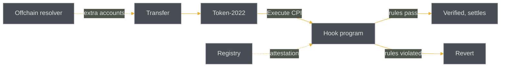

# HUKT

A Solana Token-2022 transfer hook framework. A transfer hook is a program that Token-2022 calls on every transfer of a mint, so a token can enforce its own rules the moment value moves. Think of a large railway classification yard where every wagon is routed and checked before it rolls on. Every transfer gets caught.

## Status on devnet

Live on devnet as a reference deployment. Two programs are deployed and open to build against.

- `hukt_hooks` — [`4q7Tgd9A1XfTB2i6WLUjmFXNocw6GrshZwcKgarGV9aC`](https://explorer.solana.com/address/4q7Tgd9A1XfTB2i6WLUjmFXNocw6GrshZwcKgarGV9aC?cluster=devnet)
- `hukt_registry` — [`HkTcGxnRqmyBqrmMb63cad7sfJjzUo5jY4Y3ErQWBrGv`](https://explorer.solana.com/address/HkTcGxnRqmyBqrmMb63cad7sfJjzUo5jY4Y3ErQWBrGv?cluster=devnet)

Measured on chain so far: 11 transfers hooked, 1 blocked and reverted, 1 attested registry entry. Two packages are published on npm.

## Repositories

- [hukt](https://github.com/HuktYard/hukt) — the framework monorepo: Anchor programs, shared Rust libraries, SDK, docs.
- [hukt-cli](https://github.com/HuktYard/hukt-cli) — command-line tool (`npm i -g hukt-cli`): inspect, resolve, attest, hook add, build.
- [hukt-resolver](https://github.com/HuktYard/hukt-resolver) — one-line TypeScript integration (`@hukt-labs/resolver`).

## How it works

1. Token-2022 issues an Execute CPI into the mint's hook program on every transfer.
2. The hook receives the extra accounts declared in its ExtraAccountMetaList and checks the transfer against its preset rules.
3. If a rule is violated the instruction reverts, so the transfer never settles.
4. An offchain resolver reconstructs those extra accounts for wallets and DEXs so a transfer can be built without knowing the hook internals.
5. The registry records an attestation for a hook so integrators can read its declared behavior before trusting it.

## Links

- Site: [hukt.fun](https://hukt.fun)
- X: [@huktfun](https://x.com/huktfun)
- npm: [hukt-cli](https://www.npmjs.com/package/hukt-cli), [@hukt-labs/resolver](https://www.npmjs.com/package/@hukt-labs/resolver)

CA: [CA]
